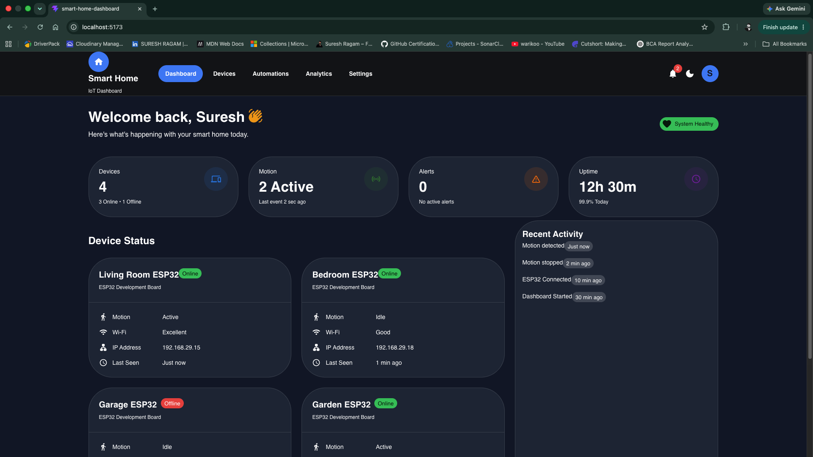

# Smart Home UI

A modern React dashboard for monitoring and controlling ESP32-based smart home devices.

## 📸 Dashboard



---

## 🚀 Features

- 📊 Dashboard overview
- 📡 Monitor connected smart home devices
- 🚶 View recent motion detection activity
- ❤️ Monitor system health metrics
- 🔄 Spring Boot REST API integration
- ⚡ Fast data fetching with TanStack Query
- 🎨 Responsive and modern Material UI interfaces

---

## 🛠️ Tech Stack

### Frontend

- React 19
- TypeScript
- Vite
- Material UI (MUI)
- Emotion
- TanStack Query
- Axios
- React Router DOM
- Recharts

### Backend

- Spring Boot REST API

---

## 📂 Project Structure

```text
src
├── api
├── app
├── assets
├── components
├── constants
├── hooks
├── layouts
├── mappers
├── pages
├── theme
├── types
└── utils
```

---

## ⚙️ Getting Started

### Prerequisites

- Node.js 20+
- npm

### Clone the Repository

```bash
git clone https://github.com/sureshragam/smart-home-ui.git
cd smart-home-ui
```

### Install Dependencies

```bash
npm install
```

### Configure Environment Variables

Copy `.env.example` to `.env`.

```bash
cp .env.example .env
```

Update the API URL if required.

```env
VITE_API_BASE_URL=http://localhost:8080/api
```

### Start the Development Server

```bash
npm run dev
```

Open your browser:

```text
http://localhost:5173
```

---

## 📜 Available Scripts

```bash
npm run dev      # Start development server
npm run build    # Build for production
npm run preview  # Preview production build
npm run lint     # Run ESLint
```

---

## 🔗 Backend

This application communicates with the **Smart Home API**, built using Spring Boot.

**Backend Repository**

```text
smart-home-api
```

**Expected Backend URL**

```text
http://localhost:8080/api
```

---

## 🚀 Future Enhancements

- [x] Dashboard UI
- [x] Spring Boot REST API integration
- [x] Device monitoring
- [x] Motion activity monitoring
- [x] System health monitoring
- [ ] MySQL integration
- [ ] ESP32 integration
- [ ] Real-time updates using WebSocket
- [ ] Device control
- [ ] Authentication & Authorization
- [ ] Push notifications
- [ ] Mobile responsive improvements

---

## 👨‍💻 Author

**Suresh Ragam**

GitHub: https://github.com/sureshragam

---

## 📄 License

This project is licensed under the MIT License.
